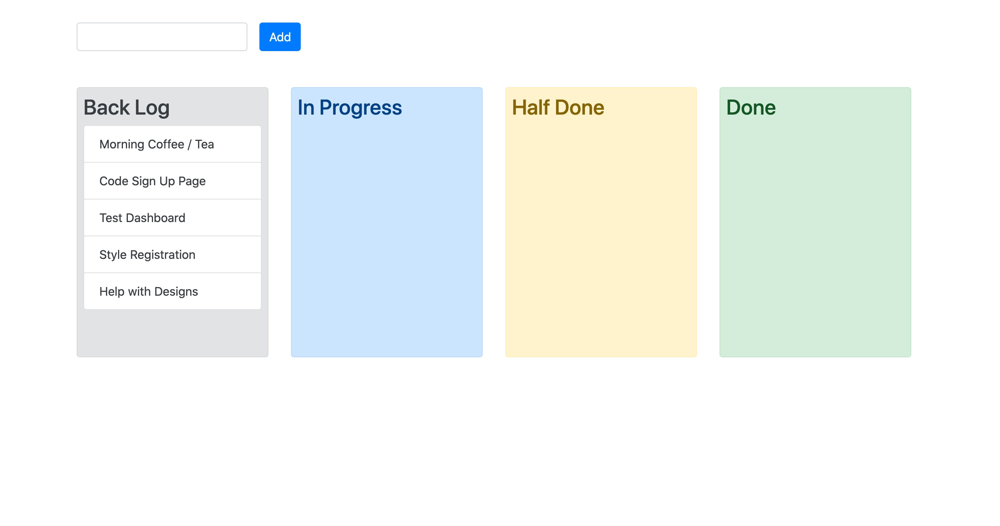

      
           

# Kanban Board App -  Vue JS ✅

                            

   

    
&emsp; &emsp; &emsp; &emsp;&emsp; &emsp; &emsp; &emsp;&emsp; &emsp; &emsp; 
        

  

> ### &emsp; &emsp; &emsp; &emsp; &emsp; &emsp; *This is  **''Kanban-Board-App"** builded with Vue JS*

--- 
  
  
 ># &emsp; &emsp; &emsp;  *What actions we can execute to our App?*

* ### *We can create, set and manage our daily tasks .*
* ### *Once after we create our task we can add it to our list with tasks(Back Log) by using the ,,Add'' button.*
* ### *Simple drag and drop option allow us to navigate and manage our tasks depending on their status during the day.(In Progress, Half Done, Done)* 👌

---
  
  

 ># &emsp; &emsp; &emsp; &emsp; *This is how the App look like!!!*
  

  

  

># &emsp; &emsp; &emsp; &emsp; &emsp; &emsp; &emsp; &emsp;  Enjoy 👍

